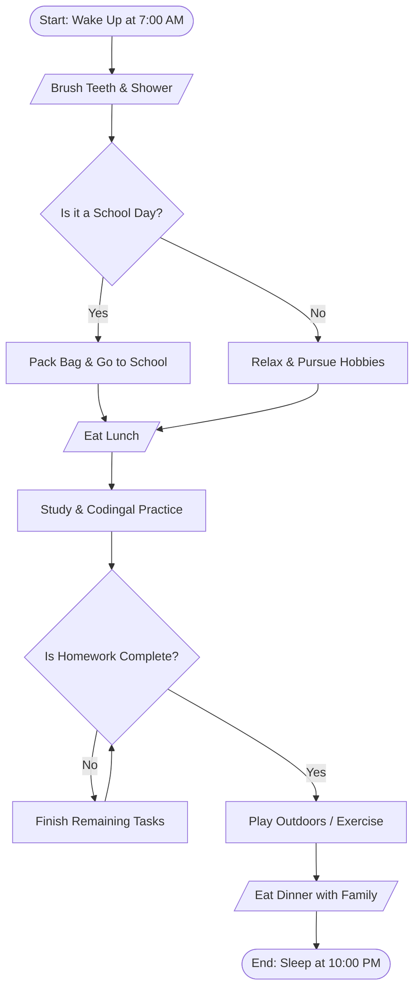

# Module 7 Lesson 1 — After-Class Project (ACP): Daily Routine Flowchart

## Project Goal
Create a visual flowchart representing a student's daily routine using **[draw.io](https://app.diagrams.net/)** (or diagrams.net).

---

## 1. Flowchart Elements Used

| Symbol | Shape Name | Meaning / Usage in Daily Routine |
|---|---|---|
| **Oval / Rounded Rectangle** | Terminator | **Start** (Wake Up) and **End** (Go to Sleep) |
| **Rectangle** | Process | Actions: Brush teeth, Pack bag, Attend classes, Study |
| **Diamond** | Decision | Conditions: "Is it a school day?", "Is homework finished?" |
| **Parallelogram** | Input / Output | Meals: Breakfast, Lunch, Dinner |
| **Arrows** | Flowline | Directs the path of execution through the day |

---

## 2. Mermaid Diagram of Daily Routine Flowchart

---

## 3. Step-by-Step Instructions to Create in Draw.io

1. Open [https://app.diagrams.net/](https://app.diagrams.net/).
2. Click **Create New Diagram** -> Choose **Blank Diagram**.
3. Drag the shapes from the left sidebar:
   - **Terminator (Rounded Rectangle/Oval)**: Add for "Start: 7:00 AM" and "End: 10:00 PM".
   - **Rectangles**: Add for daily action steps.
   - **Diamonds**: Add for decisions with `Yes` and `No` branches.
   - **Parallelograms**: Add for breakfast, lunch, and dinner.
4. Connect each shape using the blue arrow connectors.
5. Apply colors (e.g., Green for Start/End, Blue for Process, Orange for Decision).
6. Click **File -> Export as -> PNG or PDF**, or save the `.drawio` file.
7. Submit the saved file or link in your Codingal portal.
